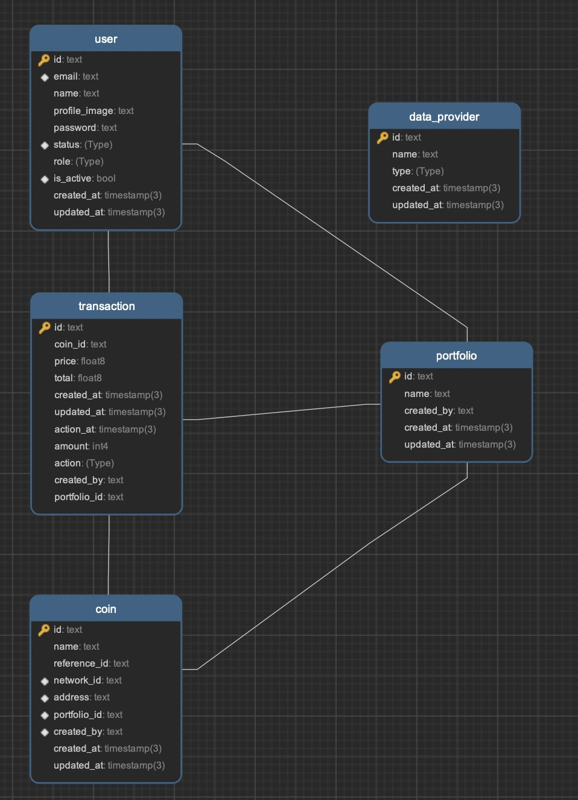

<a name="readme-top"></a>


<p align="center">
  <a href="http://nestjs.com/" target="blank"></a>
</p>

[circleci-image]: https://img.shields.io/circleci/build/github/nestjs/nest/master?token=abc123def456
[circleci-url]: https://circleci.com/gh/nestjs/nest


  <p align="center">A progressive <a href="http://nodejs.org" target="_blank">Node.js</a> framework for building efficient and scalable server-side applications.</p>
  <!--[](https://opencollective.com/nest#backer)
  [](https://opencollective.com/nest#sponsor)-->


## Prerequisites
Make sure you have installed all of the following prerequisites on your development machine:
* Git - [Download & Install Git](https://git-scm.com/downloads). OSX and Linux machines typically have this already installed.
* Node.js - [Download & Install Node.js](https://nodejs.org/en/download/) and the npm package manager. If you encounter any problems, you can also use this [GitHub Gist](https://gist.github.com/isaacs/579814) to install Node.js.
* Node.js 20.* and above
* Yarn - [Download & Install yarn](https://classic.yarnpkg.com/lang/en/docs/install/#mac-stable). Yarn package manager.

### A typical top-level directory layout

    .
    ├── ...
    ├── kryptodian                    # Your project directory
    │   ├── kryptodian-frontend         # clone and installation frontend
    │   ├────── .env                         # Your Frontend environments
    │   ├── kryptodian-backend         # clone and installation backend
    │   ├────── .env                         # Your Backend environments
    │   └── docker-compose.yml          # docker file for start web application


## Installation

```bash
$ yarn install
```


## Setup


```
NODE_ENV=development
PORT=4444

# * BACKEND BASE ENDPOINT
BASE_ENDPOINT="http://localhost:4444"

# * JWT SECRET
JWT_SECRET=tottee

# * DATABASE URL
# postgresql://{database_username}:{database_password}@db:5432/{database_name}
DATABASE_URL=

# * COIN GECKO API KEY
COIN_GECKO_API_URL=https://pro-api.coingecko.com/api/v3
COIN_GECKO_API_KEY=

# * COIN MARKETCAP API KEY
COIN_MARKETCAP_API_URL=
COIN_MARKETCAP_API_KEY=

```

### Obtaining API KEYS

* Require Coin Gecko plan atleast 'Analyst'
[Coin GeckoAPI](https://www.coingecko.com/en/api/pricing)

[Coin Market Cap](https://coinmarketcap.com/api/pricing/)

## Running the app

```bash
# development
$ yarn run start

# watch mode
$ yarn run start:dev

# production mode
$ yarn run start:prod
```

## Diagram



## Explanation

* `User` Table
This table is created for store user account which including the email, name, password and others filed for register, sign-in

* `Portfolio` Table
This table is created for store the portfolio list which including the name and creator.

* `Coin` Table
This including the cryptocurrencies coin that user holds on which portfolio

* `Transaction` Table
This table is creating for user who wants to add transaction that buy or sell in the previously.

> Currently this web application use only 1 data provider which is an CoinGecko
> This web application is not including the Test Case Scenario

## Contact

Pongsakorn Parsoppornpiboon - pongsakorn.psb@gmail.com
<br />
Github : https://github.com/Pongsakorn2341

<p align="right">(<a href="#readme-top">back to top</a>)</p>
